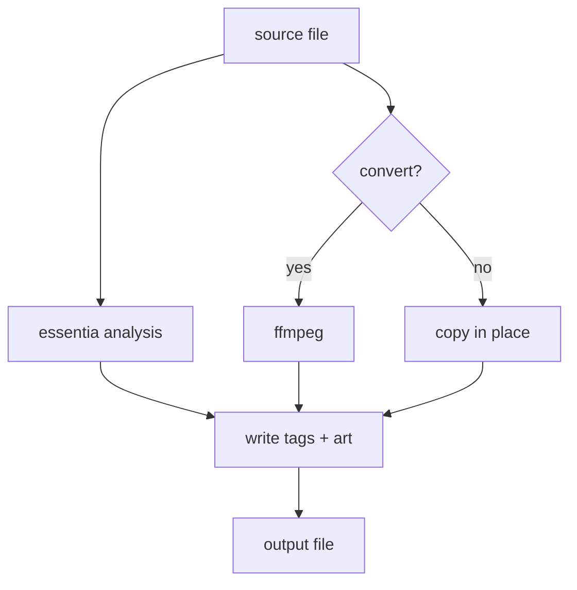

# avalon

Analyzes, tags, and organizes a music library:
- BPM/key extraction, mood/genre/energy descriptors via Essentia
- ID3/Vorbis/MP4 tag normalization
- cover art, format conversion

Runs once over a folder or as a watching daemon. MusicBrainz/Discogs
reconciliation is left to Picard.

## Requirements

- Python 3.10–3.11 (see the `essentia-tensorflow` pin in `pyproject.toml` for why)
- [uv](https://docs.astral.sh/uv/)
- `ffmpeg` on `PATH` — `brew install ffmpeg` / `apt install ffmpeg`

## Install

```bash
git clone <repository-url> && cd avalon
uv sync
```

OR 

```shell
pip install avalon-audio
```

First run downloads Essentia's models (~26.5MB) to `~/.cache/avalon/models/`.

## Usage

```bash
# tag in place
uv run avalon analyze ~/Music/Downloads --recursive

# reorganize into {artist}/{album}/{title}.{ext}
uv run avalon analyze ~/Music/Downloads --recursive --dest ~/Music/Library

# convert lossless sources, cap bit depth/sample rate (lossy sources untouched)
uv run avalon analyze ~/Music/Downloads --dest ~/Music/Library \
    --convert-lossless-to aiff --max-bit-depth 16 --max-sample-rate 48000

# watch continuously, -v so you can see it working (backfills on startup)
uv run avalon watch ~/Music/Downloads --dest ~/Music/Library -v

# backfill a large library faster with 8 concurrent worker processes
uv run avalon analyze ~/Music/Downloads --recursive --dest ~/Music/Library --workers 8

# see what's actually in a file's tags
uv run avalon inspect ~/Music/Library/Artist/Album/01\ -\ Title.aiff
```

Full flag list: `avalon analyze --help` / `avalon watch --help`.

## How it works



Analysis runs against the original file, before any conversion. Canonical
fields (title/artist/album/genre/bpm/key) only fill in when missing —
nothing gets overwritten unless you pass `--force-reanalyze`.

`--workers N` runs analysis in N separate worker processes instead of one
at a time — each has its own Essentia/TensorFlow session, so results never
cross between files. Destination-path collisions (e.g. two files with
missing tags both falling back to the same `Unknown Artist/Unknown Album`
path) are still resolved from a single process before any work is handed
to a worker, so numbering stays correct under `--workers` too.

## Tags

Two avalon-owned tags per file: a short headline (`bpm:128;key:Am;camelot:8A;
energy:0.71;genre:Techno`, in COMM/DESCRIPTION/desc, configurable via
`--headline-tag`/`--headline-format`) and an extended tag with the full
descriptor roster (`TXXX:AVALON_ANALYSIS` / a Vorbis field / an MP4 atom).

MusicBrainz/Discogs/AcoustID reconciliation isn't handled by avalon — run
[Picard](https://picard.musicbrainz.org/) over the library separately for that.

## Development

```bash
uv sync --extra test
uv run pytest
```
