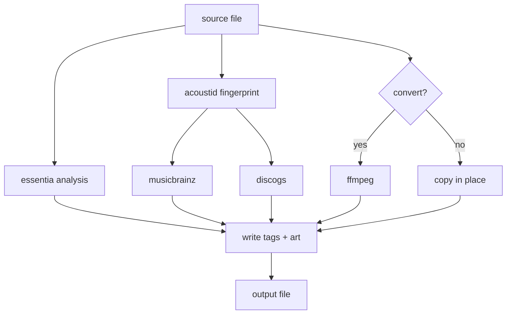

# avalon

Analyzes, tags, and organizes a music library: BPM/key extraction, mood/genre/energy
descriptors via Essentia, ID3/Vorbis/MP4 tag normalization, cover art, format
conversion, and optional MusicBrainz/Discogs lookups. Runs once over a folder or
as a watching daemon.

## Requirements

- Python 3.10–3.11 (see the `essentia-tensorflow` pin in `pyproject.toml` for why)
- [uv](https://docs.astral.sh/uv/)
- `ffmpeg` on `PATH` — `brew install ffmpeg` / `apt install ffmpeg`
- `fpcalc`, only for `--identify` — `brew install chromaprint` / `apt install libchromaprint-tools`

## Install

```bash
git clone <repository-url> && cd avalon
uv sync
```

First run downloads Essentia's models (~26.5MB) to `~/.cache/avalon/models/`.

## Usage

```bash
# tag in place
uv run avalon analyze ~/Music/Downloads --recursive

# reorganize into {artist}/{album}/{title}.{ext}
uv run avalon analyze ~/Music/Downloads --recursive --dest ~/Music/Library

# convert lossless sources, cap bit depth/sample rate (lossy sources untouched)
uv run avalon analyze ~/Music/Downloads --dest ~/Music/Library \
    --convert-lossless-to aiff --max-bit-depth 16 --max-sample-rate 48000

# watch continuously, -v so you can see it working (backfills on startup)
uv run avalon watch ~/Music/Downloads --dest ~/Music/Library -v

# also reconcile against MusicBrainz/Discogs
uv run avalon analyze ~/Music/Downloads --dest ~/Music/Library --identify

# see what's actually in a file's tags
uv run avalon inspect ~/Music/Library/Artist/Album/01\ -\ Title.aiff
```

Full flag list: `avalon analyze --help` / `avalon watch --help`.

## How it works



Analysis and identify both run against the original file, before any conversion.
Canonical fields (title/artist/album/genre/bpm/key/date) only fill in when
missing — nothing gets overwritten unless you pass `--force-reanalyze`.

## Tags

Two avalon-owned tags per file: a short headline (`bpm:128;key:Am;camelot:8A;
energy:0.71;genre:Techno`, in COMM/DESCRIPTION/desc, configurable via
`--headline-tag`/`--headline-format`) and an extended tag with the full
descriptor roster (`TXXX:AVALON_ANALYSIS` / a Vorbis field / an MP4 atom).

`--identify` adds a third (`AVALON_IDENTITY`) plus individual MusicBrainz/
Discogs/AcoustID/ISRC/label/catalog-number fields, written using Picard's own
tag names — see `avalon/constants.py` for the exact frame/atom per format —
so avalon-tagged files work with Picard, Navidrome, and anything else
MusicBrainz-aware.

## Identify setup

Needs at least one of:

- `ACOUSTID_API_KEY` — free at <https://acoustid.org/api-key>
- `DISCOGS_TOKEN` — from your Discogs account's Developer settings

`--identify` errors if neither is set. `--force-reidentify` redoes
already-identified files; `--min-identify-confidence` (default `0.7`) is the
minimum AcoustID score to trust.

## Development

```bash
uv sync --extra test
uv run pytest
```
